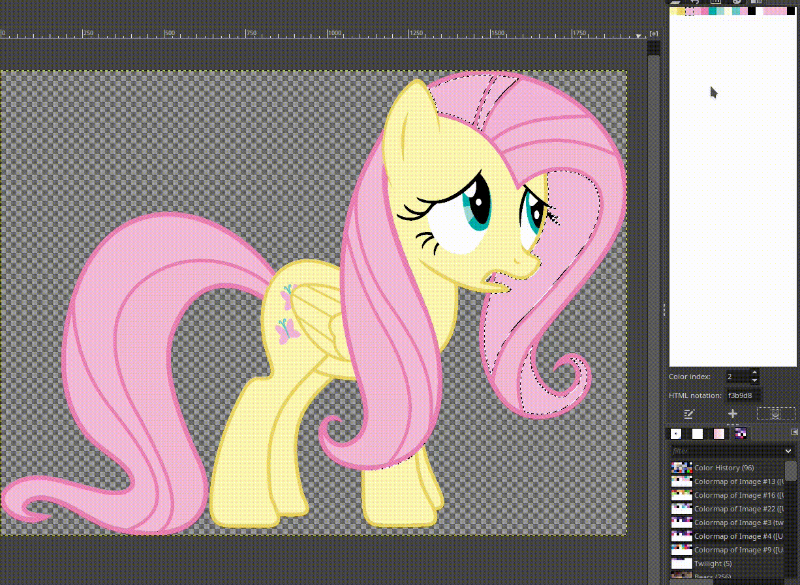

# Tutorial - How to add your own pony

So you want to add your own pony to the list? Good news, it's easy! Somewhat. It's mostly time consuming.

## Step 1: Find an image

If you plan on making your own image from scrap, skip this step. Otherwise, the easiest way to find a good picture is to visit the [MLP VectorClub on DeviantArt](https://www.deviantart.com/mlp-vectorclub). Check the galleries and folders to find the pony you're looking for.

In any case, there's a few things to keep in mind when looking for an image:
 - Most importantly, make sure you are *allowed* to use that particular image. If you're on DA the author usually says in the description if you are allowed to use their work somewhere else. If they don't allow it or do not specify, find another one.
 - Stick to "show accurate" recreations. Avoid anything that has complex shading or lighting. Of course if you want to add an OC, it will have to be made from scratch, but same thing: make sure to only use flat colors, no lighting, nothing complex.
 - Don't just pick a screenshot from the show, unless you're willing to put in the time to vector it yourself first.
 - Grab a picture that's large enough, but not too large. It shouldn't be a postage stamp, but it shouldn't be in 8K either. It's better to shrink a bigger picture than enlarge a small one, but ideally the picture you get should already be a good size to avoid problems when resizing.
 - Don't use heavily compressed JPEGs. This will just make things way harder later. Stick to PNGs.

## Step 2: Adapt the image to the requirements of the app

Once you've got your image, open it in GIMP. If you're not using GIMP, you'll have to adapt the following steps to your piece of software of choice.

### Step 2-1: Create a palette

What we're going to want to do is reduce the image to a limited palette, make sure that palette is in the right order, and that every color is where it should be.

We'll use [this image of Twilight](https://www.deviantart.com/xpesifeindx/art/Twilight-Sparkle-13-339906224) as an example, but obviously this applies to any other pony.

First, open the Colormap tab:

(By the way, if the images in this tutorial are too small, click on them to open them in a new tab.)

You won't see anything, but that's because the image isn't using a colormap yet. Next, add the palette tab and create a new palette. You can name it whatever but it makes sense to just name it the same as the pony you're working on:

Open the file [palette.txt](https://github.com/Tailszefox/Pony-Fusion/blob/master/palette.txt) somewhere, as you're going to need it. You're going to want to create a palette where each index is the right color, and the right color is applied to each area. Add each color to the palette you've just made in the right order.

For example:

You can see me picking the right color using the color picker tool, then adding it to the palette. I start with the coat, then the outline of the coat, then one of the colors of the mane, then another color of the mane, and finally the outline of the mane. Continue doing this with all the colors. 

Some parts like the pupils are sometimes made of a gradient instead of a single color. In this case, you'll have to pick one particular color in the gradient to add to the palette.

Colors 12, 13 and 14 are marked as "supplementary colors": they're used when the pony you want to add has other colors besides the one you've already added to the palette. Rainbow Dash is a good example:

As you can see, we've used colors 12 to 14 for the rest of the colors of her mane and tail. Sometimes you may need these colors for other things, like accessories (glasses, necklace, etc.).

If you don't need the supplementary colors, just add colors used for the mane (those in slots 2 and 3) in slot 12, 13 and 14. We'll tweak that later.

Once you're done, you'll end up with something like this:

Make sure you have 17 colors in total (0 to 16), that they're in the right order, and than every color corresponds to the right part of the pony.

### Step 2-2: Color fixing

When you're done, go to Image > Mode > Indexed. Pick "Use custom palette" in the window that just opened, choose the palette you just made, make sure "Remove unused and duplicate colors" is unchecked, and that all the dithering options are disabled.

You'll notice that it...doesn't look quite right.

The issue here is that we're converting an image with lots of colors to one that has way less. This means that any gradient is going to look awful. There's also the issue of anti-aliasing when transitioning from one color to another:

You can see a lot of stray pixels. I've circled one so you can see what I mean by that, but there's a lot here, and that's only a small part of the image.

This is the time consuming part of the operation: removing gradients and stray pixels.

For example, the eyes usually have a gradient. We want to eliminate that and go from this:

to this:

The iris are now only two colors: color 5 and color 6.

Another example, this time with stray pixels around the cutie mark. We want to go from this:

to this:

The cutie mark is now only made of two colors, color 8 and 9.

How you deal with this is up to you. The easiest way is to use the "Select by color" tool, click on the color you want to remove, then choose the color you want to replace it with, and draw over it. For example:

This works, but it is time consuming. Unfortunately there's not really an easier way; and if you don't do this, the result will be pretty awful. You'll end up with weird colored pixels all over the place when making a fusion, and it won't look good.

### Step 2-3: Finishing touches

Once you're done (or once you think you're done; it's easy to miss pixels, but they'll be pretty obvious later once you try), there's still a few things to do before saving your work.

If you've used every color in the palette, and every color is different, then you're done. Skip this step.

*Note: from this point, you need to use the Colormap tab, not the Palette Editor.*

If there are some colors you haven't used, or you've added the same color to the palette multiple times, then we need to change some things. The problem is that GIMP will not save a color to the palette of the final image if it's not used anywhere, and it won't add the same color multiple times. So we need to cheat a bit.

First, make sure every color is unique. For example, Fluttershy has only one color for her mane, but we need 5 different colors for it in our palette (2 and 3, and the supplementary colors, since we don't need them for anything else either). Right now, though, all of these colors are the same, so they'll be deleted by GIMP if we save. Click on color 3, then click the "Editor this color" button. Click the down or up arrow next to R, and you'll see the HTML notation change. The color is now technically different, but it's so close to the one we replaced that it's basically the same to our eyes. Do the same with every duplicate color, making sure to make them all unique. You can add +1 to red to one, -1 to red to another, +1 to green to another...

Once you're done, go through each color in your colormap and make sure the HTML notation is different for each.

Next is an optional step, but one that makes things look better: make sure to use different colors from the palette in the mane and tail of the character, even if it's only one color.

For example, Fluttershy again:

You can see that I used different colors from the palette in her mane and tail. In some places I've used color 2, in others color 3, in some color 12, etc. The reason for this is to avoid having only one color when you fuse this pony with another who has more colors in their mane and tail. If you don't do this, then the mane and tail will only be one color when fusing. Check [the fusion between Fluttershy and Rainbow Dash](https://fusion.ponyar.net/?from=flutter&to=rainbow) to see what I mean. If I had used the same color everywhere, Fluttershy's mane and tail would only be a single color and it wouldn't look like an actual fusion.

Finally, there may be times when you haven't used a color from the colormap at all. In this case, you still want to add it to the image, otherwise GIMP will delete it. To be 100% sure this doesn't happen, add 1 pixel of each color at the bottom right of the image, like this:

The bottom row of pixels is cut off by the script, so they won't appear to the user.

### Step 2-4: Saving and checking

You can now save your image as a PNG. Then, open that PNG back up in GIMP and check the colormap. There should be no missing color. If there's less than 17 colors (remember, 0 through 16), then you've missed something. You either had the same color more than once, or forgot to add one of the color to the image. Go back to your original image and check which colors are missing, and fix it by following step 2-3 again.

### Step 3: Add it to the mix

Okay, we're now done with the hardest part. Save your final image as a PNG to the "ponies" directory. Then, open the file [ponies.php](https://github.com/Tailszefox/Pony-Fusion/blob/master/ponies.php) and add your pony to the list, in whichever category that pony belongs to. The syntax is pretty self-explanatory, but here's an annotated example:

`"twilight"  => array("filename" => './twilight.png',    "first" => "Twilight",          "second" => " Sparkle", "source" => "http://fav.me/d5mddbk"),`

The first "twilight" is an internal name. It doesn't really matter what it is, just make sure it's unique for each pony. For "filename", simply put the name of the PNG you've just saved. "first" and "second" are the first and second part of the pony's name. If the pony's name is made of multiple words like here, make sure to add a space before the second part. If not, split the name in two parts wherever you feel like it (ie. "Apple" and "jack", or "Flutter" and "shy", etc.). Finally, "source" is the URL where you got the image from.

If you want to add more categories, simply add something like this:

`"breakX"    => "New category",`

Replace "X" by a number not already used by other breaks.

And that's it! Refresh the page and your new pony should be added to the list. Try it out and see if it looks good. If it doesn't (and it usually doesn't on the first try), you'll have to go back and fix what's wrong. If there are stray pixels you can notice, change their color so they blend in. If something isn't the color it's supposed to be, check you've applied the right color in the right index to the right part. Most issues should be pretty obvious and easy to fix.

If you've still got issues you can't fix, or are just confused in general, feel free to shoot me an email. Use the "Contact" button on the website to reach me. Make sure to include the original image you want to adapt and the PNG you've ended up with, so I can see what's wrong and help troubleshoot it.

And with that, have fun!
